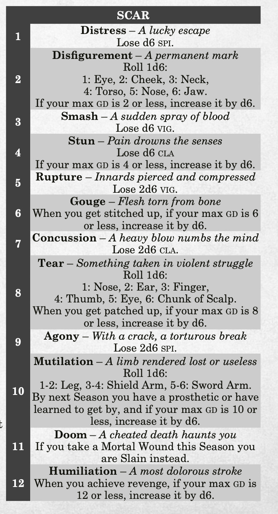
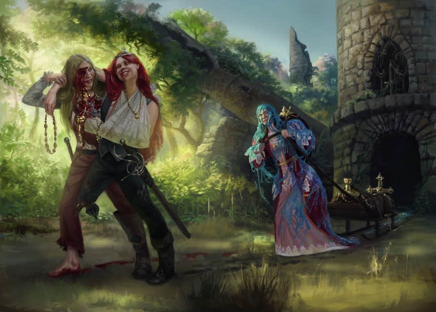
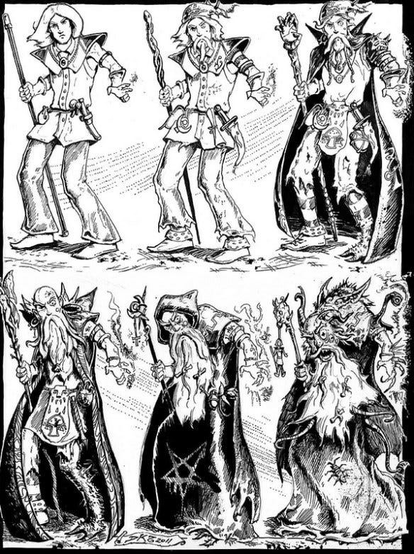
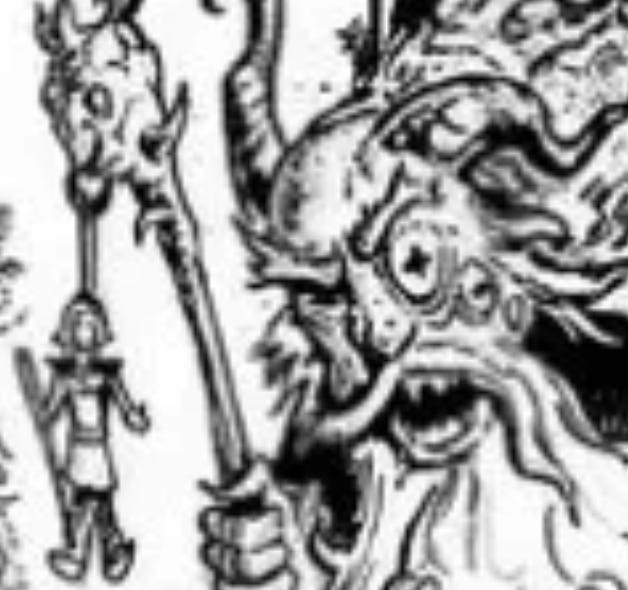

> The beast came leaping down the hall with the timbers and rafters shuddering and falling. The long table smashed. It opened its mouth and the mouth kept opening past where a mouth should stop and what belched from it was black and boiling. It splattered the warrior on the leg knee to foot. It steamed and ate the skin off the bone.
>
> The warrior sat heavily down and did not come up. He knew there would be no leg by morning if there was a morning. Nor would there be anything left of him to see it. He reached out his arm and used his good leg to push and drag himself into the corner of that hall alone for no one was left who could carry him. He propped his back against the stone and took up the crossbow from where it had fallen and began to load it.
>
> The beast turned for the healer. The healer shrank away. It came on across the stones patiently. The healer looked for the door but it was past the beast and both of them knew it.
>
> He raised the crossbow one handed and sighted down the bolt. There was one part of the beast that may be called an eye so he aimed at that. He spat blood. He loosed.
>
> With the sound of a falling hatchet hitting meat the feathers of the quarrel stuck where the beast's eye had been. It groaned and shook its head and took three steps sideways. Its knees or something like them buckled and it collapsed on its side. Its skin started to eat itself.
>
> The warrior dropped the crossbow. His leg was steaming meat falling off the bone and the pain was already coming. So too was the healer, running and pulling out the medicine pouch. A tomorrow then. A pale dawn, and something left to greet it. Fate laughs.

---

As with most things, the saint of Goblin Punch, that holy being of light, His Radiance Arnold K, [got here before me](https://goblinpunch.blogspot.com/2017/06/how-to-design-death.html).

Permanent character death is a good consequence to have. It's not the only consequence. And it's not a very interesting one. But I think it's necessary. Random death is good, negotiated character death is good, save vs death is good, TPKs are good, all of it necessary. Just not very interesting. "You fucked up, now you can't play that character ever again" is boring by definition.

It takes every choice off the table. You can't make choices for a character you no longer play.

Look at how other systems handle the moment you hit zero.

**Daggerheart** has a great death mechanic. You have three options when you get dropped:

- Go out in a blaze of glory -- take one action, it automatically succeeds, afterwards you die.
- Avoid death -- you're taken out of the scene and come back later, alive.
- Risk it all -- 50% chance you come back with a little more fight in you, 50% chance you die outright.

Of course I have no interest in playing Daggerheart because I'm not a filthy storygamer. ~~That's a great mechanic actually and I respect it.~~

Moving on:

**Cities Without Number**, that sleazy Cyberpunk sister in the Sine Nomine family, has traumatic wounds that can destroy cyberware and require the use of prosthetics. You can install cyberware that is purpose built to take a traumatic wound for you, or you can lose a limb, an eye, something, and get it replaced with the upgraded cyber version. Then that cyberware can also get wrecked, which means you need money to fix it, which means you need to take more jobs.

**Mythic Bastionland**, bold and pure, has a Scars table. Hit zero Guard exactly and you gain a Scar. Some Scars like R U P T U R E! are straightforwardly bad and make everything worse. BUT! A few will actually increase your Guard once you've learned to live with them, thereby increasing your survivability.

**Warhammer Fantasy**, my beloved and vicious, (4e) has Crit tables for every situation and location. One of our first character deaths happened when our resident artist got chopped in half by a mutant lobster claw on a very low crit roll. There was a moment of bated breath whenever the DM had to pull forth the rulebook and flip through the crit severity tables. Everyone wanted to see how bad it was going to be.

Now.

Compare all of that to death at zero, or a flat death save. It's boring.

## Some Art

Behold this Lamentations of the Flame Princess art (artist unknown to me, credit LotFP).

Basically I want them different than when they came in.

Similar to this from Dungeon Crawl Classics, which is probably my favorite piece of RPG art ever. It just says so much:

Yes, death should be on the table. But so should character progression through hardship. Wounds. Trauma.

So I want to preserve that CHOICE and the way characters CHANGE while also introducing more horrible things that happen to them.

The problem with wounds in a lot of games is that they are completely random and do not rely on player input. You get your eye put out and now you're blind and you just take a mechanical penalty. That's also boring.

It's boring to just make your character worse at stuff, randomly.

So here.

## Wounds as Written

I just call it Taking a Wound. It's a damage gate.

This is a variation of the mechanic that created that scene in the intro to this post. The warrior's leg really was melted by acid spray, their movement really was crippled, they really did load a crossbow bolt and kill a beast with a crit right as it was advancing on the squishy healer. But the alternative was full unconsciousness and probably TPK.

But he didn't want to get knocked out, he wanted to Take a Wound and keep fighting.

## Mechanics for stealing

Adamant, the system I'm working on, has three basic defenses. **Armor** is flat damage reduction. **Defense** is your skill at not getting hit. **Body** is mortal flesh.

When a hit gets through Armor and Defense is fully depleted, the damage carries into Body. And when it does, you can choose to **Take a Wound.**

🗡️ **Taking a Wound** halves the damage from that hit. It could be the difference between getting killed vs staying in the fight.

🗡️ But when you do this, you have to **mark one Wound** in your load (inventory). It gets harder to carry stuff.

🗡️ Then there's a 50% chance the wound is **SEVERE**, which means put another wound in your load.

🗡️ **Each wound is a cumulative -1 penalty** to everything you roll. This is a 2d6 system so that's a lot.

🗡️ Wounds don't go away just because you went to sleep. It takes an **Interlude**, which is a period of weeks in a safe place. During an interlude, you roll 1d6 plus the Medicine skill (1-5) of whoever's tending you, restore that much Body, and clear half that many Wounds, rounding up.

🗡️ Whatever's left over sets into a **Scar**. Scars are permanent, but don't give you a penalty. They just take up one load.

## Thoughts

This creates a system where yes, you can take several horrible blows, but you'll be paying for them later. You can port it into just about any system. Lethality goes down. Grittiness goes up.

I like the abstractness of this so the player doesn't have to track -2 on perception rolls out of your left eye or in darkness or the more granular things. All it tracks is how wounded you are, and how bad it sucks, and applies the results to EVERYTHING.

For the discerning GM, you can pair it with your favorite crit table for maximum effect.

Of course, my heart hasn't gone completely soft. Just in case the PCs start getting ideas, there are enemies that cause unavoidable wounds on crit, too.
